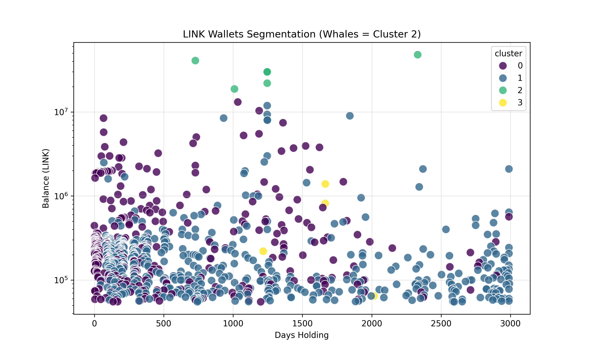

# 🐳 Link Marines Watcher: AI-Driven Whale Tracker

This project identifies and tracks "Smart Money" behavior in the Chainlink ecosystem using Unsupervised Machine Learning.

It uses **Dune Analytics** API to fetch on-chain data, **K-Means Clustering** to segment wallets by behavior, and sends real-time alerts about high-value movements to Telegram.

### 📊 How it works
1. **Extraction:** Fetches top 1000 holders via Dune SQL.
2. **Analysis:** Python (`sklearn`) normalizes data and segments wallets into 4 behavioral clusters.
3. **Identification:** Dynamically identifies the "Whale Cluster" based on holding size and logic.
4. **Alerting:** Pushes instant reports to Telegram if the target group expands.

### 📈 Clustering Visualization
*Generated automatically by the script based on current on-chain data.*

 

### 🛠 Tech Stack
*   **Python 3.10+**
*   **Data:** Pandas, Dune API
*   **ML:** Scikit-Learn (K-Means)
*   **Viz:** Matplotlib, Seaborn
*   **Notify:** Telegram Bot API

### 🚀 Usage
1. Clone the repo
2. Create `.env` file with `DUNE_API_KEY` and `TELEGRAM_BOT_TOKEN`
3. Run `python analysis.py`
